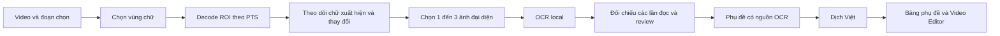

# Kế hoạch OCR phụ đề trong video → phụ đề tiếng Việt

**Smoke resume cuối, 2026-09-12:** user cho tiếp tục sau Escape. EXE chạy từ
đúng vị trí dist, tự tìm v6 medium và kiểm SHA; mở OCR/resume, đóng GUI exit0
sau79,953s,0child/không traceback. Backup/khôi phục cache giữ15hash theo dõi.
Không build, quét video hoặc chạy suite lại. **Gate resume đã khép**;
[biên bản](../dev/ocr-resume-2026-09.md). Dòng gate còn thiếu dưới đây là lịch sử.

**Resume 2026-09-12:** [source, CLI và GUI đã có](../dev/ocr-resume-2026-09.md).
Giữ checkpoint v1, đọc kiểm cue ở điểm nối bằng PTS/SHA, tiếp tục phần thiếu.
Full1.839pass/5skip; binary/native staging khớp2.842cue của bản full, dùng
6.314frame thay12.316frame. Đã cập nhật riêng app vào gói OCR6, có quay lui.
User dừng Computer Use bằng Escape ở bước smoke tại dist; gate đó còn thiếu.
Không tự lưu khi crash, không mở thêm vision/API hoặc corpus.

**Cache binary/native, 2026-09-12:** [gate đã khép](../dev/ocr-cache-binary-2026-09.md).
Build riêng app, dùng lại models OCR6 hiện có; đã thay EXE/`_internal` trong
gói giữ lại và có app quay lui. CLI/GUI cold2request → warm0request/6hit,
status/clear, ID/raw/review/export guards, cancel và close-while-busy pass.
203 test liên quan pass; full suite cũ không chạy lại. Worker thêm `-B` để
không sinh bytecode vào runtime. Resume decode, auto-accept, vision GUI,
downloader/update và corpus rộng vẫn mở. Các trạng thái trước đó là lịch sử.

**Tiếp tục sau dọn, 2026-09-11:** user tự dọn các bản nặng, giữ OCR6.
[Cache disk/quota ở source](../dev/ocr-cache-2026-09.md) đã có raw JSON/checksum,
LRU/quota 64 MiB mặc định, GUI/CLI status/clear và fallback khi disk lỗi.
Full offline 1.817 pass/5 skip; schema/IDs/review guards giữ nguyên. **Chưa
build cache vào EXE giữ lại**; resume decode, auto-accept/vision GUI và
downloader vẫn mở. Các ghi chú dọn bị chặn bên dưới là lịch sử trước khi
user tự dọn; không tiếp tục nhiệm vụ xóa model cũ.

**Gate v6 cuối, 2026-09-11:** [biên bản bổ sung](../dev/ocr-final-gates-cleanup-2026-09.md)
khép ba gate còn mở: full offline 1.794 pass/5 skip, hủy và đóng hộp thoại
OCR đang bận trên EXE hiện có. Chỉ sửa helper test chờ Qt, không build/copy
thêm models. Phần dọn 8 bản sao khoảng 389 GB bị tool policy chặn dù user
đã xác nhận; chưa giải phóng phần này. Các mục mở rộng OCR giữ phạm vi riêng.

**Tích hợp ứng viên 2026-09-11:** [v6 medium](../dev/ocr-v6-integration-2026-09.md)
đã nối profile/runtime và luồng OCR, giữ metadata v5/stable IDs/review guards.
Runtime ứng viên có thư mục riêng; các gate source, đóng gói và GUI được ghi
riêng ở biên bản. Chưa hiệu chuẩn auto-accept; không thay kết quả chất lượng cũ.

**Chất lượng/model, 2026-09-11:** [chẩn đoán v5 và so sánh v6](../dev/ocr-quality-v6-2026-09.md)
đã xác nhận tensor vẫn có chữ bị v5 bỏ sót. V6 medium và v5-det/v6-small-rec
giữ đủ chữ/số **23/23** crop của video, exact lần lượt **19/23,18/23**, còn
sai khác dấu câu; mỗi cấu hình qua6/6fixture tổng hợp. Trọn bộ v6 small có
detector bỏ dấu ba chấm đầu một cue. Medium là ứng viên chất lượng, kết hợp
là ứng viên tốc độ; **chưa tích hợp/đổi mặc định hoặc hiệu chuẩn auto-accept**.
Bước tiếp là profile/runtime đúng model từng stage và nghiệm thu ứng dụng/
binary sau khi tích hợp, không chạy thêm sweep hoặc chuyển ưu tiên sang log UI.
Các số OCR-1 v5 bên dưới là baseline lịch sử; cap vision14 không tăng.

**Tiếp tục 2026-09-11:** [bản Việt tham khảo trong review](../dev/ocr-review-assistance-2026-09.md)
thêm action dịch text của một candidate và đối chiếu các bản đọc bằng tiếng Việt.
Bản dịch chưa nhìn ảnh, chỉ giữ trong phiên, không thay raw/duyệt và chưa sửa
lỗi cùng bỏ sót chữ. Chưa tích hợp GPU/vision GUI hoặc tăng budget; các số đo
chất lượng pilot giữ nguyên. [GUI gói ổ C](../dev/ocr-relocation-2026-09.md)
đã có evidence trước lượt này; các snapshot còn thiếu gate đó bên dưới là lịch sử.

**Tiếp tục OCR-4, 2026-09-10:** đã thêm [GUI OCR local, crop review và bundle runtime](../dev/ocr-gui-2026-09.md).
Có chọn video/selection/ROI, worker hủy được, preview đúng crop/PTS/hash, review có
undo/redo và handoff bảng phụ đề; runtime dùng bộ đã cài. Chưa có downloader,
cache disk, auto acceptance hoặc budget vision mới. Gate binary ghi riêng trong
biên bản OCR-4, không dùng source pass để suy ra frozen/GUI pass.

**OCR-3 source, 2026-09-10:** đã có [visual identity/document/review/CLI và metadata](../dev/ocr-document-2026-09.md),
giữ raw/edited/PTS qua JSON/dịch/editor, chặn source mismatch và review chưa giải
quyết. Profile vẫn chưa hiệu chuẩn; không mở lại model/vision hoặc gọi OCR toàn
sản phẩm hoàn tất. GUI/model manager/cache disk/binary OCR vẫn chưa có; trạng
thái OCR-3 chưa triển khai trong các snapshot bên dưới là lịch sử trước phiên này.

**Tiếp tục 2026-09-10:** [CPU worker đã nối và quét sample thật](../dev/ocr-runtime-2026-09.md):
1.800 frame → 13 track, 38 fresh/1 cache hit, 10/13 exact và 12/13 đủ chữ-số,
hủy inference/process/readers đã kiểm. Đã sửa Unicode pipe và codec noise tracking.
Vision thêm 8 response, tổng 12/13 ảnh có kết quả trong 13 attempts; request crop 5
bị timeout chưa retry. Chưa chốt engine/default hoặc hoàn tất chất lượng/timing
độc lập/OCR-3/4. Các trạng thái “chưa nối CPU worker” bên dưới thuộc lượt trước.

**Cập nhật tiếp 2026-09-10:** [OCR-2 domain/fixture và vision qua gateway](../dev/ocr-streaming-2026-09.md)
đã có streaming PTS/ROI/buffer/tracking/consensus/cache RAM/lifecycle. Chưa nối
recognizer CPU thật vào pipeline hoặc triển khai OCR-3/4. Vision `gpt-5.6-terra`
qua gateway user chọn: 5 request, 4 response, crop 5 timeout, không retry; còn 8
crop chưa gửi. Trên 4 crop chung, hai nhánh 3/4 exact; vision 4/4 đủ chữ, local 3/4.
Không suy thắng/thua trên 13 crop hoặc chọn mặc định. Chi tiết gate/giới hạn nằm
trong biên bản mới; các mô tả “chưa triển khai OCR-2” bên dưới là snapshot trước đó.

**Cập nhật sau pilot 2026-09-10:** [OCR-1 local đã đo trên 13 crop](../dev/ocr-pilot-2026-09.md):
13/13 có chữ, 10/13 exact và 12/13 đủ chữ theo tham chiếu agent; chưa đủ để xuất
không review. Runtime CPU/package riêng đã kiểm, 6 fixture tổng hợp pass. Nhánh AI
đã chuẩn bị nhưng chưa chọn endpoint/model/key scope/budget; chưa có API comparison.
Các mô tả “chưa chạy OCR” bên dưới là lịch sử OCR-0, không phải trạng thái hiện tại.
Chưa triển khai OCR-2/3/4 hoặc chốt engine mặc định.

**User ngày 2026-09-10 đã mở lại OCR cho phiên kế tiếp sau sửa Soniox/Qwen.**
Theo [prompt OCR đã cập nhật](../dev/ocr-next-session-prompt.md), bắt đầu pilot OCR-1
trên cùng 13 crop. OCR chưa được khởi chạy trong phiên sửa ASR; các gate ASR còn mở
giữ phạm vi riêng, không dùng chúng để tự trì hoãn yêu cầu OCR mới.

Ngày 2026-09-08. Trạng thái: **thống kê prototype và thiết kế, chưa triển khai tính năng**.
Baseline code Lifetime `e6c0074`, HEAD `fb2bfad`, nhánh `codex/asr-s3-native`.
Giữ các thay đổi tài liệu đang có. User giao lập kế hoạch OCR; không tự mở S6,
cài runtime/dependency, đổi model ASR, build, commit hoặc push trong phiên lập kế hoạch.

Đề xuất thêm lựa chọn **Phụ đề trong hình (OCR)** vào màn Nhận dạng. OCR local lấy chữ
và thời gian hiển thị; kết quả được đưa vào bảng phụ đề, dịch Việt và Video Editor
hiện có. OCR không cần chạy lại Qwen/ForcedAligner, không tự nhận diện người nói.

**Bổ sung theo trao đổi sau kế hoạch:** user đánh giá cách agent đọc ảnh tốt. Giữ cả
OCR local và AI đọc ảnh như hai lựa chọn có thể tích hợp, chưa chọn mặc định hoặc
chứng minh bên nào tốt/rẻ hơn. OCR-1 cần pilot cùng 13 crop trước khi chốt vị trí của
AI trong MVP; không chỉ mặc định AI là fallback sau cùng. Xem
[prompt phiên tiếp theo](../dev/ocr-next-session-prompt.md). Việc chốt/push tài liệu không
tự khởi chạy pilot hoặc cấp quyền job vision API khi chưa chọn model/endpoint.

## 1. Thống kê phương pháp vừa thực hiện

Evidence local: `build/asr-session-evidence/VC-UserClip-20260908-114035/`.
Số liệu tổng hợp bằng `summarize_ocr_method.py`, lưu trong
`reports/ocr-method-statistics-20260908.json`. Không chạy lại media/model để lấy số pass.
Không đưa tên/path video, chữ nguồn, ảnh hoặc bản dịch riêng của user vào tài liệu Git này.

**Phần đọc chữ chưa dùng engine OCR tự động.** FFmpeg/Pillow tìm các đoạn có chữ;
agent đọc ảnh tổng hợp và chép 13 câu. Cần thay phần đọc ảnh đó bằng OCR local khi làm app.

| Chỉ số | Số liệu | Cách hiểu |
| --- | --- | --- |
| Nguồn / phần đã thử | 111,333 s / 60 s đầu; 1920×1080 | Một video do user chọn |
| Vùng chữ cuối cùng | x=0, y=960, w=1920, h=80 | 7,41% diện tích frame; đã chọn theo clip này |
| Dữ liệu đưa vào bộ theo dõi | Grayscale 960×40, 25 mẫu/s | Khoảng 1.500 mẫu theo 60×25; prototype không lưu frame count thực tế |
| Ngưỡng phát hiện | Pixel >185; số pixel sáng >90 | Heuristic cho chữ sáng trên nền tối, không phải OCR |
| Nhận cùng câu | IoU của hai mask ≥0,70 | So độ giao nhau/chồng khít của vùng sáng |
| Ảnh đại diện | Mask có nhiều pixel sáng nhất trong nhóm | Chưa có phép đo độ nét hoặc confidence OCR |
| Lượt gom ban đầu | 33 nhóm, crop từ y=940, 10 mẫu/s | Lẫn một dải hình chuyển động; có nhóm giả |
| Lượt gom sau chỉnh ROI | 13 nhóm/cue, tổng 94 ký tự chữ/số | Agent đọc 13 câu trong ảnh tổng hợp |
| Khoảng có phụ đề | 13.040–55.000 ms; tổng thời gian hiện 28,04 s | Không đồng nghĩa mọi thời điểm trong khoảng đều có chữ |
| Độ dài cue | Nhỏ nhất 1,28 s; trung vị 1,72 s; lớn nhất 4,24 s | Tính từ các đoạn hiển thị đã lưu |
| Lưới lấy mẫu | 40 ms | **Không phải chứng nhận sai số timing ≤40 ms**, chưa đối chiếu PTS nguồn |
| Thời gian lệnh quét cuối | Khoảng 2,664 s | Một lần đo tool command gồm Python/FFmpeg/gom nhóm/tạo ảnh; **chưa gồm engine đọc chữ** |
| Engine OCR local đã chạy | 0 lượt | Chưa cài RapidOCR/PaddleOCR/Tesseract |
| Token agent cho bước này | Chưa có số liệu tách riêng | Đọc ảnh/biên tập có dùng token; không được ghi thành 0 |
| RAM/VRAM đỉnh | Chưa đo | Không suy từ kích thước file ảnh |

Với mẫu này, **13 ảnh đại diện so với khoảng 1.500 mẫu pixel** giảm 99,13% số ảnh cần
đọc nếu đọc một ảnh/cue. Đây là phép tính số ảnh, không phải mức giảm token hay tăng tốc
OCR đã đo. Nếu dùng tối đa ba ảnh/cue để đối chiếu, ngân sách dự kiến là 13–39 lượt
nhận dạng crop, chưa tính detector và trường hợp cần review; thực tế phải đo ở OCR-1.

Các bước khác có thời gian riêng: ASR bị từ chối 46,375 s; Google dịch 13 câu 15,047 s;
export target-only 0,312 s; render bản biên tập 8,141 s. Không cộng các số này rồi gọi
là thời gian OCR. Bản Google còn sai thuật ngữ; OCR đúng chữ không tự bảo đảm dịch đúng.

Prototype dùng `capture_output` rồi tạo danh sách toàn bộ frame trong RAM. Theo kích
thước mẫu danh nghĩa, riêng payload grayscale là 57.600.000 byte (~54,9 MiB); giữ thêm
bản Pillow tương đương khoảng 109,9 MiB cho hai payload, chưa gồm object/process/copy
tạm. Đây là suy tính bộ nhớ dữ liệu, không phải RSS đã đo. **Không đưa nguyên cách giữ
toàn video vào RAM này vào app.**

## 2. Phạm vi bản đầu

- Nhận video có một vùng phụ đề cố định, chữ ngang một hoặc hai dòng; ưu tiên Trung
  giản thể/phồn thể, giữ nguyên script, tên riêng, số và dấu câu. Chạy được khi video
  không có audio. Vùng chữ rõ trên nền tối là ca đầu, rồi kiểm tra chữ viền/nền động.
- Chọn đoạn cần trích, kéo vùng chữ trên preview, chạy local, xem cue cần review,
  chuyển sang dịch tiếng Việt và lưu JSON/SRT hoặc mở Video Editor.
- Nếu có subtitle stream dạng text, ưu tiên đề nghị trích stream trước OCR. Stream
  bitmap/PGS không được gọi là text; đánh dấu chưa hỗ trợ riêng ở bản đầu.
- Không hứa hỗ trợ karaoke hiện từng chữ, chữ chạy/cuộn, phụ đề dọc, nhiều vùng chữ
  đổi vị trí, phục hồi phần chữ bị che hoặc xóa/inpaint chữ Trung đã burn vào hình.
  Gặp trường hợp này phải báo giới hạn, không xuất rỗng như thành công.
- Không tự rơi từ ASR lỗi sang OCR; user chọn chế độ OCR và vùng chữ. Hai kết quả giữ
  nguồn gốc riêng. Diarization/TTS/xưng hô suy từ giọng nằm ngoài OCR bản đầu.

## 3. Engine và runtime đề xuất

| Phương án | Vai trò đề xuất | Điều cần xác minh |
| --- | --- | --- |
| **RapidOCR + ONNX Runtime CPU** | Ứng viên đầu cho bản tích hợp local | Model/decoder/dictionary tương thích; tiếng Trung có viền, tên riêng, chữ phồn thể; thời gian/RAM trên máy thực |
| PaddleOCR trực tiếp | Phương án đối chiếu nếu bản ONNX không giữ chất lượng | Runtime riêng và dependency lớn hơn; không cài cả hai làm mặc định |
| Tesseract `chi_sim` / `chi_tra` | Phương án dự phòng, không bắt buộc cho MVP | Có language packs nhưng chưa đo chất lượng font game; không suy thua/thắng khi chưa thử |

RapidOCR hỗ trợ triển khai offline, ONNX Runtime và model chuyển từ PaddleOCR
([repository](https://github.com/RapidAI/RapidOCR)). PP-OCRv5 có recognizer hỗ trợ cả
giản/phồn thể ([PaddleOCR recognition](https://www.paddleocr.ai/main/en/version3.x/module_usage/text_recognition.html)).
Ứng viên kỹ thuật là detector mobile + recognizer Chinese server của PP-OCRv5; chưa
chốt version hoặc SHA khi chưa kiểm tra gói model thực. Kích thước tải và tốc độ CPU
của bản ONNX phải đo riêng, không lấy số benchmark upstream làm kết quả máy user.

[Danh sách RapidOCR](https://rapidai.github.io/RapidOCRDocs/main/en/model_list/) cho thấy
model mặc định thay đổi theo phiên bản, hiện có cả PP-OCRv6. Vì vậy không khởi tạo
`RapidOCR()` với mặc định ngầm: cấu hình rõ detector/recognizer, version, dictionary,
preprocessing; pin package và hash từng file. Chọn v5 là điểm bắt đầu khảo sát,
không khẳng định hơn v6. [Tesseract](https://tesseract-ocr.github.io/tessdoc/Data-Files-in-different-versions.html)
có `chi_sim` và `chi_tra`, nhưng chưa là bằng chứng nghiệm thu video.

Runtime OCR là process riêng, ưu tiên Python 3.12 + CPU ONNX. Không import NumPy,
OpenCV, ONNX, Paddle hoặc Torch vào Qt process; môi trường Qt hiện không có NumPy.
Không nâng CUDA/Qt hoặc đụng runtime Qwen/VieNeu. CPU OCR không chiếm GPU lease;
nếu thêm GPU sau này phải tham gia cơ chế lease hiện có.

Mở settings chỉ đọc trạng thái. Download/install là action rõ ràng trong Quản lý
mô hình; manifest/lock/hash, trạng thái chưa cài/đang cài/sẵn sàng/lỗi tách biệt.
Inference dùng model local đã chọn và chặn tải ngầm; lỗi thiếu model dừng trước job.
Ghi nhận license của package/model khi chốt recipe, không suy license chỉ từ wrapper.

## 4. Pipeline cần xây



**Nguồn và ROI.** Probe stream, rotation, kích thước hiển thị, SAR/time base/duration.
Lưu ROI chuẩn hóa trên ảnh đã áp rotation/SAR; đổi đúng giữa tọa độ widget, letterbox
và pixel nguồn. Không hardcode y=960 hoặc threshold 185 cho mọi video. Video/audio
user giữ nguyên. Tận dụng nguyên tắc snapshot hủy được ở `core/asr/local/audio.py`,
nhưng tạo snapshot video thuộc job OCR, có kiểm tra dung lượng và cleanup; không sửa
API ASR chỉ để chia sẻ code. Hash trong cùng lượt copy để hạn chế đọc file thêm.

**Decode và thời gian.** Giữ PTS/time base gốc cùng mỗi frame; canonical cue timing
là integer ms trên timeline video, gồm offset khi chọn đoạn không bắt đầu từ 0.
Không dùng đơn thuần `frame_index / 25` cho VFR/nonzero PTS. `fps` có thể thêm/bỏ frame
([FFmpeg filters](https://ffmpeg.org/ffmpeg-filters.html#fps)); prototype chưa lưu mapping
đó. Bản chuẩn xử lý ROI streaming theo frame/PTS nguồn, lưu last-seen/first-seen và
độ bất định ở biên. Fast sampling là tùy chọn sau, không làm cơ sở cam kết frame-accurate.
Tại đầu/cuối selection, đánh dấu cue bị cắt bởi đoạn chọn thay vì giả định đã thấy
trọn câu. Timing OCR phản ánh chữ trên màn hình, không phải phoneme/word timing.

**Streaming.** Reader FFmpeg có frame + PTS được ghép/kiểm tra thứ tự; thiếu metadata
hoặc frame hỏng phải dừng, không tự dựng giờ. Hàng đợi tối đa tám ROI frame và tối đa
ba ứng viên đang giữ cho mỗi track chữ; backpressure khi OCR chậm. Theo dõi biến đổi
trên ảnh nhỏ nhưng giữ crop màu đủ nét cho recognizer. Không giữ list toàn video hoặc
lưu một PNG cho từng frame. stderr phải được drain đồng thời, timeout/cancel đóng
đúng cây process và join reader. Dùng `child_environment()` và contextvars helper.

**Gom và nhận dạng.** Detector/edge-mask đề xuất vùng dòng chữ trong ROI, không coi
mọi pixel sáng là chữ. Nhận cả trắng/vàng/chữ viền. Theo dõi ổn định/biến đổi/fade,
chọn crop rõ và vài thời điểm khác nhau; OCR chỉ khi nội dung thay đổi hoặc cần xác
minh ứng viên. Có giới hạn thời gian giữ một nhóm và phát hiện đổi một ký tự để tránh
gom nhầm câu gần giống. Câu giống nhau nhưng xuất hiện lại sau khoảng trống phải là
cue mới. Không dedup toàn video chỉ bằng text hash.

**Chốt chữ.** Giữ raw candidates, score và bbox từng dòng. Đồng thuận chọn một chuỗi
đã được engine đọc thật; không ghép ký tự từ nhiều kết quả thành chuỗi chưa từng đọc.
Confidence engine chưa được hiệu chuẩn thành xác suất đúng. Ngưỡng chốt phải đo ở
OCR-1; bất đồng, ít nét, chữ bị che, khoảng biên mơ hồ được giữ `needs_review`, không
âm thầm bỏ câu. Không chuyển giản/phồn thể, tự sửa tên hoặc dùng LLM điền chữ thiếu.

**Dịch và xuất.** Đưa dữ liệu typed trực tiếp sang pipeline phụ đề, không qua SRT
trung gian làm mất metadata/nhầm hai dòng nguồn thành hai ngôn ngữ. Mặc định OCR giữ
các câu và giờ đã đo; split/optimize chỉ khi user chọn. Translator/LLM dùng cấu hình
đang có, không tự chọn Google làm mặc định sản phẩm. Thuật ngữ/ngữ cảnh phải được
truyền minh bạch và tham gia cache key. OCR không tự sinh quy tắc xưng hô theo speaker.

## 5. Contract, review và dữ liệu

Domain mới `core/ocr/`, độc lập Qt:

- `OcrConfig`: ROI, đoạn chọn, ngôn ngữ, model profile, sampling/tracking/consensus policy.
- `VisualSourceIdentity`: SHA-256 toàn file snapshot + video stream, geometry/transform,
  time base và đoạn chọn. Bản đầu đổi container có thể phải xác minh lại; không coi là
  cùng nguồn chỉ vì cùng duration. **Không dùng AudioIdentity để xác minh OCR**: hai video
  có audio giống nhau vẫn có thể có chữ khác nhau; video không audio vẫn phải làm việc.
- `OcrCandidate`: frame PTS, bbox/dòng, raw text, score, model revision; crop reference local.
- `OcrCue`: ID ổn định, measured start/end, candidate refs, raw/edited text riêng,
  trạng thái/issue, biên clipped/uncertain. Không có speaker tự suy.
- `OcrDocument` / `ocr-document-v1`: config snapshot, visual identity, cues, metrics và
  trạng thái review. Lưu atomically; output chưa giải quyết không được xuất như success.

Thêm trường tùy chọn `ocr_metadata` ở `ASRDataSeg`/`EditorCue` và `visual_source` ở
`ASRData`/`EditorProject`, đặt sau tham số cũ để giữ call site positional. Không nhét OCR
vào `ASRMetadata(timing="native"/"aligned")`. `editor-project-v1` giữ tên schema, thêm
optional fields với decoder có validation; fixture cũ vẫn mở. Binary cũ có thể bỏ
trường mới khi save, nên không hứa round-trip OCR qua binary trước tính năng này.

Audit mọi clone/merge/split/translation/table export/JSON/editor save để giữ các trường
mới. `has_metadata` phải nhận nguồn OCR; nếu không, `_on_transcript_finished()` hiện
có thể đi qua nhánh path/SRT và mất provenance. Split/merge giữ lineage candidate/ID,
không tự biến giờ đã sửa thành giờ OCR đã đo. `CommandStack` quản lý edit/undo/redo;
normal save vẫn JSON + SRT, ASS chỉ khi user chọn.

Editor hiện kiểm tra cue duration/overlap khác nhau dựa vào `asr_metadata`. Cần thêm
kiểm tra timing OCR tường minh; không giả ASR provenance để vượt validation. Cue ngắn
được giữ số đo và báo khó đọc; không tự kéo dài/clamp. OCR bản đầu là một khối phụ đề
một/hai dòng, không tự gán nhiều speaker hoặc bật diarization pending.

Review hiển thị crop, video seek, bản Việt dự thảo, lỗi dễ hiểu và thay đổi raw/edited.
User không biết tiếng Trung: không thiết kế việc hoàn tất mỗi cue phụ thuộc user chấm
chữ Trung. Thử crop khác có giới hạn trước; cue vẫn bất định phải giữ cảnh báo. Hỗ trợ
AI đọc crop là lựa chọn giữ trong thiết kế; phạm vi MVP chốt sau pilot OCR-1 và lựa
chọn dịch vụ của user, không gọi nền mặc định.

## 6. Điểm nối vào repository

| Khu vực | Thay đổi khi triển khai |
| --- | --- |
| `core/ocr/` mới | models, decoder, tracking, recognition adapter, pipeline, review, runtime, cache |
| `core/entities.py`, `ui/task_factory.py` | `OcrTask` và `create_ocr_task()`, giữ TranscribeConfig/ASR enum cũ |
| `ui/view/transcription_interface.py` | Chọn nguồn Âm thanh / Phụ đề trong hình; đoạn chọn, ROI, progress/cancel |
| `ui/components/ocr_region_dialog.py`, `ocr_review_dialog.py` mới | Vẽ ROI và review, business logic nằm trong core |
| `ui/thread/ocr_thread.py` mới | `result_ready` riêng, không override `QThread.finished`; dùng WorkerSupervisor/connect_current |
| `cli/main.py`, `cli/commands/ocr.py`, `ocr_review.py` mới | `ocr` và local review/resume, cùng service core với GUI |
| `core/asr/asr_data.py`, `core/translate/base.py`, `core/subtitle/editing.py` | Bảo toàn nguồn OCR trong clone, typed handoff và xuất |
| `core/editor/models.py`, `adapters.py`, `project_store.py`, `commands.py` | Optional OCR fields, cue validation và mutation có undo |
| `videocaptioner/resources/ocr/`, builder và `VideoCaptioner.spec` | Recipe/bridge/manifest runtime riêng; không bundle dependency OCR vào Qt |
| `ui/common/config.py`, translation source files | Cấu hình OCR độc lập, đồng bộ bundle/fallback translations |

CLI dự kiến, **chưa có trong app**:

```text
videocaptioner ocr input.mp4 --start 00:00:00 --end 00:01:00 \
  --roi 0,0.888889,1,0.074074 --language zh --ocr-runtime <root> \
  --review pending.ocr.json -o captions.json --report metrics.json
videocaptioner ocr-review pending.ocr.json --source input.mp4 -o captions.json
videocaptioner subtitle captions.json --target-language vi --layout target-only -o captions.vi.srt
```

ROI là x/y/w/h chuẩn hóa, chỉ minh họa vùng của prototype, không là mặc định mọi video.
Tái sử dụng exit codes đã có: validation/config/input lỗi tách biệt; review chưa giải
quyết là processing failure, không trả exit 0 với phụ đề thiếu. Không đổi lệnh/flag ASR cũ.

## 7. Dung lượng, cache và token

- Mọi dữ liệu app theo `config.py` ở source/pip/frozen; không tạo thư mục VC-* rải ở root
  ổ đĩa. Job tạm dưới `APPDATA_PATH/ocr/jobs/<id>`, cache riêng dưới `APPDATA_PATH/ocr/cache`.
  Runtime cài một lần ở root OCR được quản lý; không copy EXE cho mỗi job người dùng.
- Decoder giữ buffer giới hạn. Chỉ giữ thumbnail cue cần review và metadata; không
  giữ toàn video dưới dạng ảnh. Snapshot video có kiểm tra dung lượng và cleanup khi
  hoàn tất/hủy; model/runtime và kết quả user lưu không bị nút dọn cache xóa.
- Cache có hạn mức dung lượng/eviction, key phụ thuộc source/ROI/transform/policy/model/
  dictionary và nội dung crop. Tách raw/review khỏi kết quả đã chấp nhận. Không đưa
  credential, tên/path riêng tư hoặc text rõ vào tên key/log; cache values vẫn là dữ liệu local.
- **Local OCR mặc định: 0 request/token LLM cho phần trích chữ.** Đây là thiết kế mục
  tiêu; prototype hiện có token agent đọc ảnh chưa được ghi riêng. Dịch text qua LLM
  có usage riêng; Google không cung cấp token LLM của app để thống kê như OpenAI.
- AI vision tùy chọn chỉ nhận crop cần xử lý, không toàn video, có budget theo job
  và xác nhận dịch vụ/chi phí khi bật. Dùng credential LLM đúng endpoint, không lấy STT
  key. Không log prompt ảnh/text/response riêng tư. Token ảnh phụ thuộc model và kích
  thước ([OpenAI Docs](https://developers.openai.com/api/docs/guides/images-vision#calculating-costs));
  chỉ ghi usage provider trả về, không chuyển 99,13% giảm số ảnh thành 99,13% giảm token.

Report đề xuất: duration/actual frames/PTS policy, ROI, số nhóm, số detector calls,
số recognizer crops, số cache hit, cue accepted/review, tách decode/tracking/OCR/translate/
render wall time và total wall time. Đo RSS host/sidecar/FFmpeg, temp/cache bytes và
optional GPU metrics. Stage chạy chồng nhau không cộng thời gian thành total giả.
Usage thiếu để `null`/không có số liệu, phân biệt với 0 requests thật. GUI dùng dữ liệu
trong RAM; `--report` hoặc action xuất report mới persist thống kê dài hạn.

## 8. Các bước triển khai và điều kiện hoàn thành

| Gói | Công việc | Điều kiện ra khỏi gói |
| --- | --- | --- |
| **OCR-0 — hiện tại** | Thống kê prototype, xác định phần agent đọc, thiết kế và điểm nối | Có tài liệu này + report local; chưa gọi engine mới |
| **OCR-1 — pilot local/AI** | Chuẩn bị cùng 13 crop; chốt runtime local và cấu hình nhánh AI khi có lựa chọn dịch vụ rõ ràng | Đo đúng/sai/review, latency/RSS/footprint/offline và token thực; tách đọc chữ khỏi dịch; không lấy bản agent đã đọc làm lượt vision API độc lập |
| **OCR-2 — thời gian và tracking** | Streaming PTS, ROI transform, grouping/consensus/cache/cancel | Không miss/merge sai fixture; VFR, nonzero start, repeated text, fade, two lines, empty ROI, video no-audio; bộ nhớ frame bị chặn bởi queue size |
| **OCR-3 — dữ liệu, CLI và review** | Typed OCR document/identity, export/resume, adapters/CommandStack, metrics | Round-trip source/IDs/raw/edited/timing giữ nguyên qua dịch/JSON/editor; source mismatch bị chặn; cue nghi vấn không âm thầm xuất success |
| **OCR-4 — GUI và binary** | Chọn đoạn/ROI, worker lifecycle, model manager, bảng phụ đề/editor, đóng gói | GUI phản hồi/cancel/save-reopen/native smoke; source↔bundle match; nghiệm thu riêng binary OCR |

OCR-1 dùng nội dung 13 câu đã có và fixture tổng hợp để xác định khả thi. Hiện chỉ có
contact sheet và video mẫu: cần trích 13 crop độc lập ở representative_ms, dùng cùng
bộ input cho các nhánh; không OCR header thời gian của contact sheet. Không mở corpus
hay chạy phần video user còn lại trong phiên lập kế hoạch. Nếu recognizer chưa đạt,
báo cụ thể case sai và điều chỉnh kế hoạch trước khi làm toàn bộ GUI. Không cài nhiều
engine hoặc gọi cloud để che lỗi. Phiên hiện tại chỉ hoàn thành OCR-0.

Sau pilot mới chốt chế độ AI đọc ảnh trong MVP hay phần tiếp theo. Trích bitmap
subtitle stream, vùng chữ thay đổi và đối chiếu audio là phần mở rộng sau MVP.
Benchmark sản phẩm/video dài hoặc so engine ASR mặc định vẫn
là S6 riêng, chưa được giao. Không bao gồm xóa chữ gốc khỏi video.

## 9. Gate kiểm thử cần có khi code

1. **Nội dung:** fixture có text chính xác; so từng cue/script/tên/số/dấu câu. Thử câu
   chỉ khác một ký tự, lặp lại sau khoảng trống, hai dòng và frame mờ; không chấp nhận
   âm thầm câu sai. Với clip mẫu, báo riêng 13 câu đúng/sai/cần review từ engine thật.
2. **Timing:** fixture có PTS nguồn và biên hiển thị biết trước, kể cả VFR/offset/rotation/
   SAR. Bản quét chuẩn phải khớp biên trong một frame nguồn đối với fixture không fade;
   fade hoặc không đủ mẫu phải ghi khoảng bất định. Không gọi 40 ms là độ chính xác đã pass.
3. **Identity và metadata:** hai video cùng audio/duration nhưng khác chữ phải mismatch;
   edit/undo/redo, dịch selection, clone/split/merge, JSON/project/SRT giữ contract.
   SRT chỉ giữ text/time; người dùng được hướng tới JSON/project để giữ nguồn OCR.
4. **Tài nguyên/lifecycle:** hủy giữa decode/OCR, process treo/exit/malformed response,
   EOF/truncated frame, missing model, GPU không có, không network, cache eviction;
   UI không block, reader join và `thread.wait()` trước fixture rời scope.
5. **Cách ly:** tmp/cache/settings/credential test cô lập; chỉ fixture tổng hợp/public
   được phép vào Git. Không lấy media hoặc AppData thật làm fixture, không tải model
   trong unit tests. Engine integration có marker riêng và báo skip thật.
6. **Quality/build:** test gần trước; ruff/pyright/CLI/translations theo AGENTS. Thay đổi
   metadata/runtime/lifetime cần full offline khi triển khai, không dùng pass cũ thay
   regression mới. Build một spec, tên/output mới; báo exit/warnings, size/time/SHA-256,
   startup đúng artifact và workflow OCR thực. Giữ artifact/runtime Lifetime nguyên vẹn.

Chưa có số đo để cam kết tổng thời gian OCR tự động, peak RAM hoặc token agent tiết
kiệm bao nhiêu. OCR-1 sẽ tạo số đo đầu tiên; số liệu này và chất lượng chữ quyết định
cấu hình sản phẩm, không chọn theo tên model hoặc một bảng benchmark upstream.
